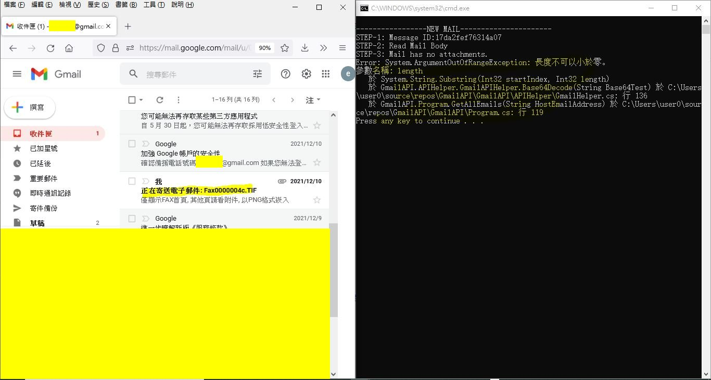

# Gmail_OAuth2.0
Gmail API using .NET C# with Source Code (Reading mails and Attachments)

this is not my coding but other was doing,

orignal source code,  
https://www.youtube.com/watch?v=0fTSKtPBLUc  
https://drive.google.com/file/d/1PgipOrZBqEbgXCK8VGguR3XSwsk9Ww9T/view  


the only thing landed me two hours of testing because no new email in the Gmail inbox, and the original code had no any prompt, so .... adding prompt to the code and then user may see more easy whether gmail fetching via OAuth succeed.  


modified Program.cs

```
                // prompt for user. xiaolaba 2022-MAR-08
                Console.WriteLine("done, you may see return EmailList for unread.");
                Console.WriteLine("if nothing, send email to yourself and then try again.\r\n");
                Console.WriteLine("Gamil read via OAuth2.0");
                Console.WriteLine("ref: https://developers.google.com/identity/protocols/oauth2\r\n");

                Console.WriteLine("orignal source code,");
                Console.WriteLine("https://www.youtube.com/watch?v=0fTSKtPBLUc");
                Console.WriteLine("https://drive.google.com/file/d/1PgipOrZBqEbgXCK8VGguR3XSwsk9Ww9T/view\r\n");

                return EmailList;

```


App.config  
```
  <appSettings>
    <add key="HostAddress" value="you_gmail_account@gmail.com" />

```


create 3 folders
```
C:\GmailAPI\ClientCredentials
C:\GmailAPI\CredentialsInfo
C:\GmailAPI\GmailAttachment
```

download client_xxxxxxxxxxxx_secret.json, save to C:\GmailAPI\ClientCredentials\client_secret.json  

change to my .NET framwork 4.5  

成功的畫面
  

機器發出的EMAIL, 讀取時有 BUG, 沒時間研究  
  

動機, 這個從2011年開始用FAX.TIF, 一直用低安全性等入, CDO 寫的機器, 終於 GOOGLE 說2022年5月30號就斷炊, 所以唯有花時間.  
  
